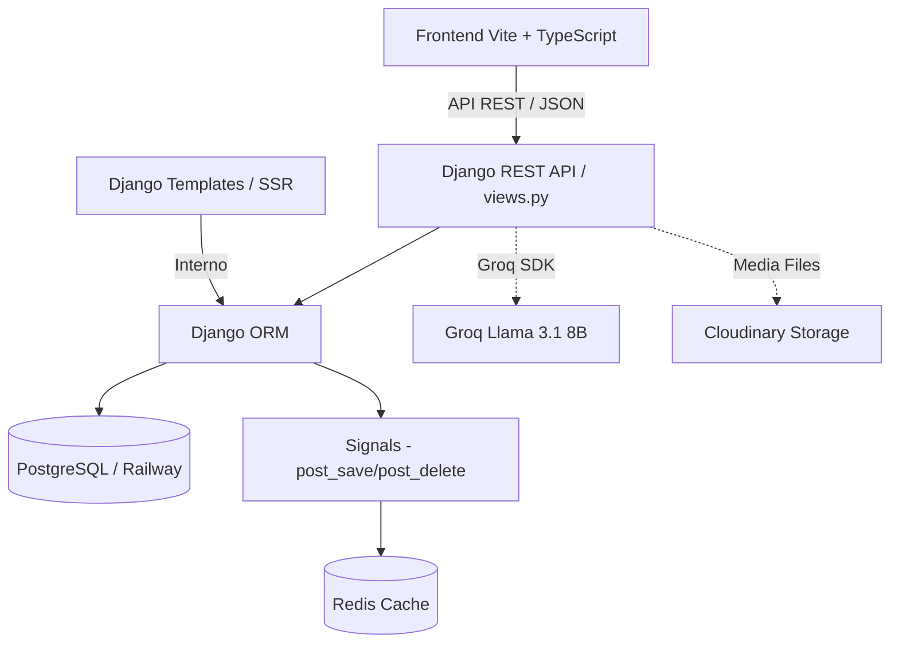

# Arquitetura do Sistema - AutoDrive

Este documento descreve a organização técnica, o fluxo de dados e os componentes de arquitetura do **AutoDrive (Carros)**.

---

## 1. Visão Geral da Arquitetura

O sistema é dividido em duas partes principais:
1. **Backend Django (Rest API + SSR)**: Gerencia as regras de negócio, persistência de dados, integração com IA, caching e autenticação.
2. **Frontend Vite + TypeScript**: Aplicação cliente multipáginas (MPA) que consome os endpoints da API REST do Django, salvando as credenciais do usuário localmente.

---

## 2. Estrutura do Backend (Django)

O backend é modularizado em três aplicativos principais:

### 2.1 App `app`
- Contém as configurações centrais do Django (`settings.py`), rotas principais (`urls.py`) e middleware customizado.
- **Middleware CORS (`middleware.py`)**: Implementa o `SimpleCORSMiddleware` para gerenciar cabeçalhos de CORS (Access-Control-Allow-Origin, Headers, Methods, Credentials), viabilizando a comunicação segura entre o frontend SPA (rodando em porta diferente) e o Django.

### 2.2 App `cars`
- Gerencia o ciclo de vida dos veículos e marcas.
- Contém os modelos centrais:
  - **`Brand`**: Armazena as marcas de veículos (ex: Fiat, Ford, Honda).
  - **`Car`**: Armazena os dados dos veículos (modelo, ano, placa, valor, foto e descrição comercial). A relação com `Brand` é protegida com `on_delete=models.PROTECT`.
  - **`CarInventory`**: Registra o histórico da contagem total de carros e o valor somado do estoque.
- **Signals (`signals.py`)**:
  - Um receptor (`clear_cache_before_change`) é associado aos eventos `post_save` e `post_delete` do modelo `Car`. Ele limpa automaticamente o cache do Redis sempre que um carro é criado, editado ou removido, mantendo o inventário atualizado e as listagens sincronizadas.

### 2.3 App `accounts`
- Gerencia o controle de acesso e autenticação dos usuários.
- Oferece suporte duplo: renderização direta de templates HTML (`login.html`, `register.html`) e respostas em formato JSON para clientes SPA baseados em chamadas API sem recarregamento de página.

### 2.4 App `openai_api`
- Encapsula a integração com o provedor de IA **Groq** utilizando o modelo `llama-3.1-8b-instant`.
- Contém a função `get_car_ai_bio` para gerar descrições sob demanda e o script `cars_ai.py` que realiza a carga de demonstração com base no arquivo `brands.csv`.

---

## 3. Estrutura do Frontend (Vite + TypeScript)

O frontend é um projeto estático em TypeScript configurado com Vite, organizado por pastas que representam as páginas da aplicação:
- `cars/index.html` (Garagem / Listagem) -> Executa `src/cars.ts`
- `car_detail/index.html` (Visualização / Edição / Exclusão) -> Executa `src/car_detail.ts`
- `new_car/index.html` (Cadastro) -> Executa `src/new_car.ts`
- `login/index.html` & `register/index.html` -> Executam `src/auth.ts`

### 3.1 Fluxo de Autenticação no Frontend
- Após o login bem-sucedido via API, o token de autenticação retornado é armazenado no `localStorage` sob a chave `auth_token`.
- A função auxiliar `apiFetch` (em `src/api.ts`) anexa automaticamente o cabeçalho `Authorization: Token <token>` em todas as requisições subsequentes.
- Se uma requisição retornar status `401 Unauthorized`, o token é descartado e o usuário é redirecionado de volta para a página de Login.

---

## 4. Estrutura do Banco de Dados

### Tabela `cars_brand`
- `id`: AutoField (Chave Primária)
- `name`: CharField (200 caracteres)

### Tabela `cars_car`
- `id`: AutoField (Chave Primária)
- `model`: CharField (200 caracteres)
- `brand_id`: ForeignKey para `cars_brand` (PROTECT)
- `factory_year`: Integer (Aceita nulo/em branco)
- `model_year`: Integer (Aceita nulo/em branco)
- `plate`: CharField (10 caracteres, aceita nulo/em branco)
- `value`: Float (Aceita nulo/em branco)
- `photo`: ImageField (Upload para o Cloudinary, aceita nulo/em branco)
- `bio`: TextField (Aceita nulo/em branco)

### Tabela `cars_carinventory`
- `id`: AutoField (Chave Primária)
- `cars_count`: Integer
- `cars_value`: Float
- `created_at`: DateTimeField (Preenchimento automático na criação)
